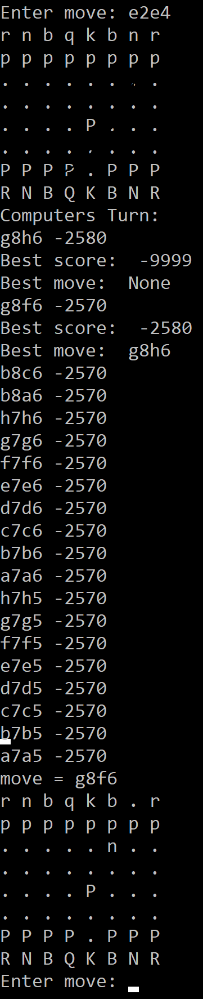

# chess_ai
Python program that uses the chess point system, minimax algorithm and alpha beta pruning to effectively play chess.

### Steps To Play Against AI

1. Make a move using UCI format (ex. piece's location on the board followed by the new location of the piece on the board, e2e4)  

1. Let the AI determine its optimal move  

1. Repeat  

##### Full Sequence

### Modifying the AI
The algorithm's depth can be changed for either calculating better moves or to speed up the ai in the game loop on line 229 (the preset is 5).  
